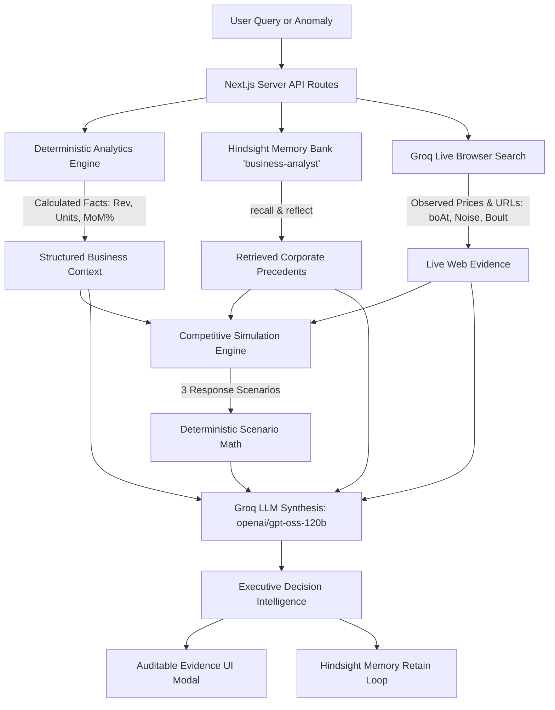

# 🧠 BizMind — Hindsight-Powered AI Decision Intelligence Platform

> **"An institutional memory decision intelligence platform that remembers what the company tried, why it tried it, what happened afterward, and uses those experiences when analyzing future business decisions."**

Built for the **HackWithHyderabad** Hackathon. Powered by **Hindsight Cloud** persistent memory and **Groq** high-speed LLM & live browser search.

---

## 🌟 Executive Overview

In most modern enterprises, business intelligence tools describe *what is happening*, but they have total amnesia about *what was already tried and what happened afterward*. When team members change or quarters pass, companies repeat identical strategic mistakes because their institutional memory is lost in disconnected slide decks or Slack threads.

**BizMind** solves this by establishing a permanent, self-improving **Institutional Decision Intelligence Loop**:

```
Business Data ──► Deterministic Analysis ──► Strategic Decision ──► Observed Outcome
      ▲                                                                     │
      │                                                                     ▼
Future Decision ◄── Experience Retrieval & Reflection ◄── Hindsight Memory Bank
```

---

## 🏢 Demo Workspace: GOAT Consumer Electronics

To demonstrate BizMind in a realistic enterprise setting, the platform is pre-configured to operate on a fictional Indian consumer-electronics company: **GOAT** (`GOAT Consumer Electronics India`).
- **Operating Brand**: GOAT
- **Industry**: Consumer Electronics
- **Primary Category**: Headphones & Audio
- **Market**: India (Currency: INR / `₹`)
- **Fictional Catalog Products**:
  - `GOAT Rockerz 550` (Wireless Over-Ear Headphones, Baseline: ₹1,499)
  - `GOAT Airdopes 141` (True Wireless Stereo Earbuds, Baseline: ₹1,299)
  - `GOAT Nirvana 751` (Premium Active Noise-Cancelling Headphones, Baseline: ₹3,499)
  - `GOAT Stone 350` (Portable Bluetooth Speaker, Baseline: ₹1,499)

> **Important Architecture Distinction**:
> - **BizMind** is the application platform and AI decision intelligence system.
> - **GOAT** is the enterprise company operated and analyzed inside BizMind.
> - Real Indian market competitors (**boAt**, **Noise**, **Boult**, **JBL**, **Sony**) are researched dynamically from live public web sources for competitive intelligence.

---

## 🔄 Core Decision & Memory Pipeline

The application enforces strict **epistemic boundaries** and separation of concerns:



### 4-Layer Separation of Evidence

To guarantee mathematical truth and prevent hallucinations, evidence types are strictly isolated:
1. **CURRENT BUSINESS FACTS**: Derived purely via TypeScript math from company transaction records (Revenue, Units, ASP, MoM Growth). Zero LLM arithmetic.
2. **HISTORICAL INSTITUTIONAL MEMORY**: Retrieved from Hindsight Cloud bank (`business-analyst`). Details prior company actions, rationales, and evaluated outcomes.
3. **LIVE WEB EVIDENCE**: Public competitor prices and active offers captured via Groq's `openai/gpt-oss-120b` browser search with clickable source URLs.
4. **DERIVED SCENARIOS & ASSUMPTIONS**: Purely mathematical models (No Response, Partial Response 50%, Full Response 100%) with explicit behavioral assumptions.

---

## 🚀 Key Features

### 1. 🧠 Hindsight Institutional Memory Engine
- **Memory Retention (`retain`)**: Records business decisions with structured metadata (action, reason, target metric, expected growth) and pairs them with evaluated outcomes and strategic lessons.
- **Contextual Retrieval (`recall`)**: Dynamically retrieves relevant historical precedents when analyzing new questions or product challenges.
- **Cognitive Reflection (`reflect`)**: Synthesizes accumulated memories across product categories, identifying whether price elasticity in one tier applies to another.
- **"Why did the AI say this?" Audit Trail**: Clickable evidence modal displaying the exact memories and facts cited by the agent.

### 2. ⚡ Deterministic Business Analytics
- Ingests raw CSV sales logs (Date, Product, Quantity, Revenue, Region, Channel).
- Calculates exact KPIs: Total Revenue, Units Sold, Average Order Value (AOV), Average Selling Price (ASP), and Revenue Share %.
- Computes Period-over-Period (MoM) growth and flags anomalies (drops >15% categorized as High/Medium severity situations).

### 3. 🎯 Competitive Impact Analysis
Allows users to ask complex strategic questions like:
> *"What happens if GOAT reduces the Rockerz 550 price by 10%?"*  
> *"Should GOAT reduce the price of the Rockerz 550 from ₹1,499 to ₹1,349?"*  
> *"How would a 10% price reduction affect GOAT's competitive position?"*

- **Mathematical Price Metrics**:
  - Absolute Change: `₹1,499 ➔ ₹1,349 (-₹150)`
  - Percentage Move: `-10.0%`
  - Competitor Price Gaps & Relative Price Indices (`(Company Price / Competitor Price) * 100`).
  - Observed Position Shift: E.g., *"Moves from Above 2 and below 1 ➔ Below 2 of 3 observed competitors"*.
- **3 Deterministic Simulation Scenarios**:
  - **Scenario 1: No Response** (Competitors maintain current offers; GOAT secures immediate pricing edge).
  - **Scenario 2: Partial Response** (Competitors match 50% of the discount; price gap narrows).
  - **Scenario 3: Full Response** (Competitors match 100% of the price cut; initiates margin compression risk).
- **Verifiable Source Attribution**: Every competitor claim includes an exact source URL, domain, and timestamp.
- **Financial Impact Policy**: Declares that while competitive price position can be evaluated, revenue cannot be guaranteed without explicit demand elasticity assumptions.

### 4. 📜 Strategic Decision & Outcome Timeline
- An interactive chronological ledger tracking:
  - Anomalies detected
  - Decisions logged
  - Outcomes evaluated vs targets
  - Lessons retained into Hindsight

---

## 🎭 The 7-Step Hackathon Demo Story

BizMind includes an **Interactive Hackathon Demo Journey** banner allowing judges to step through the entire institutional loop in one click:

| Step | Action | Business Narrative & Technical Mechanism |
|---|---|---|
| **Step 1** | **Upload Jan Data** | Ingests January 2026 data. Deterministic engine detects **GOAT Rockerz 550 revenue dropped -24.3%** under aggressive competitor price discounting. |
| **Step 2** | **Analyze & Advise** | AI Analyst analyzes the decline and recommends testing a targeted 10% price reduction to restore volume. |
| **Step 3** | **Record Decision** | Manager approves reducing price from ₹1,499 to ₹1,349 (-10%). **Retained into Hindsight bank** with expected target of +15% volume. |
| **Step 4** | **Upload Feb Data** | Ingests February 2026 data. System computes actual performance: **Units surge +52.9%** (280 ➔ 428) and **Revenue recovers +37.6%** (₹4,19,720 ➔ ₹5,77,372). |
| **Step 5** | **Record Outcome** | Evaluates outcome as `BETTER_THAN_EXPECTED`. **Retains institutional lesson into Hindsight**: *"GOAT Rockerz 550 exhibits high price elasticity. A 10% discount quickly won back price-sensitive customers in wireless headphones without destroying gross margins."* |
| **Step 6** | **Airdopes Query** | Ingests March data where `GOAT Airdopes 141` sales soften. User asks: *"Should GOAT reduce the price of GOAT Airdopes 141 based on past Rockerz lessons?"* Hindsight **recalls and reflects** on Rockerz 550 lessons, warning that TWS earbuds have different buyer demographics. |
| **Step 7** | **Competitive Impact** | User runs Competitive Impact Analysis on `GOAT Rockerz 550` (₹1,499 ➔ ₹1,349). System searches live prices for **boAt, Noise, Boult**, models 3 response scenarios, and presents an auditable strategy breakdown. |

---

## 🛠️ Tech Stack & Architecture

- **Frontend Framework**: Next.js 15.5 (App Router, Server & Client Components)
- **Language**: TypeScript 5.7 (Strict type-checking)
- **Styling**: Tailwind CSS, Lucide Icons, Glassmorphism UI
- **Memory Provider**: **Hindsight Cloud** (`@vectorize-io/hindsight-client`)
- **LLM & Search Provider**: **Groq SDK** (`groq-sdk`)
  - Primary Model: `openai/gpt-oss-120b` (with browser search tool enabled)
  - Fallback Model: `qwen/qwen3.8-27b` (automatic failover on rate limits)
- **Data Persistence**: Server-side local JSON store (`.data/business_state.json`) protected by `.gitignore`

---

## 📁 Project Structure

```text
├── src/
│   ├── app/
│   │   ├── api/
│   │   │   ├── chat/route.ts               # Chat endpoint with Hindsight recall/reflect & auto competitive routing
│   │   │   ├── competitive-analysis/route.ts # Direct Competitive Impact Analysis API
│   │   │   ├── datasets/route.ts           # CSV upload, KPI engine & preset loaders
│   │   │   ├── decisions/route.ts          # Decision logging & Hindsight memory retention
│   │   │   ├── outcomes/route.ts           # Outcome evaluation & institutional lesson retention
│   │   │   ├── timeline/route.ts           # Chronological business timeline events
│   │   │   └── hindsight/test/route.ts     # Health and bank connectivity check
│   │   ├── globals.css                     # Tailwind styling & dark mode setup
│   │   ├── layout.tsx                      # Root layout with fonts & metadata
│   │   └── page.tsx                        # Main interactive dashboard & 7-step stepper
│   ├── components/
│   │   ├── AIAnalystChat.tsx               # Chat interface with memory citation pills
│   │   ├── BusinessOverview.tsx            # KPI metric cards & product performance table
│   │   ├── CompetitiveAnalysisModal.tsx    # 3 Scenarios, observed competitors & evidence audit modal
│   │   ├── DatasetUploadModal.tsx          # CSV uploader & one-click demo presets
│   │   ├── DecisionModal.tsx               # Decision form with target metric & expected growth
│   │   ├── DemoWalkthroughBanner.tsx       # 7-step interactive hackathon journey banner
│   │   ├── Header.tsx                      # Brand header with Hindsight bank connectivity badge
│   │   ├── MemoryEvidenceModal.tsx         # "Why did the AI say this?" Hindsight evidence viewer
│   │   ├── OutcomeModal.tsx                # Outcome evaluator & lesson capture
│   │   └── SituationsList.tsx              # Detected business anomalies & crisis cards
│   ├── config/
│   │   └── company.ts                      # Centralized GOAT company configuration & product catalog
│   ├── data/
│   │   └── sample-datasets.ts              # Synthetic CSV datasets (Dec, Jan, Feb, Mar)
│   ├── lib/
│   │   ├── analytics.ts                    # Pure deterministic CSV parser & KPI engine
│   │   ├── competitive-engine.ts           # Deterministic price gaps, rankings & 3 scenario models
│   │   ├── competitive-research.ts         # Groq browser search agent & citation parser
│   │   ├── competitive-service.ts          # Orchestration layer uniting internal data, Hindsight, and web
│   │   ├── db.ts                           # Server-side business state storage
│   │   ├── groq.ts                         # Groq client with epistemic prompts & model failover
│   │   └── hindsight.ts                    # Hindsight service (retain, recall, reflect)
│   └── types/
│       ├── business.ts                     # Business decisions, outcomes, KPIs, and situations
│       └── competitive.ts                  # Scenarios, web evidence, and calculations
├── scripts/
│   ├── test-backend-flow.ts                # E2E decision loop & Hindsight integration test
│   ├── test-competitive-flow.ts            # Competitive analysis pipeline test
│   ├── test-groq.ts                        # Direct Groq connectivity & model test
│   └── test-hindsight.ts                   # Direct Hindsight API retain/recall/reflect test
├── tests/
│   ├── business-analyst.test.ts            # Unit tests for CSV parsing, KPIs, and anomaly math
│   └── competitive-calculations.test.ts    # Unit tests for price deltas, gaps, rankings, and scenarios
└── package.json
```

---

## ⚙️ Environment Variables

Create a `.env` file in the root directory:

```env
# Groq LLM Configuration
GROQ_API_KEY=gsk_your_groq_api_key_here
GROQ_MODEL=openai/gpt-oss-120b

# Hindsight Cloud Configuration
HINDSIGHT_API_KEY=your_hindsight_api_key_here
HINDSIGHT_BASE_URL=https://api.hindsight.vectorize.io
HINDSIGHT_BANK_ID=business-analyst
```

> **Security Note**: All API keys are strictly accessed on the Next.js server side. Neither key is ever exposed to client bundles or browser code. `.env` and `.data/` are protected in `.gitignore`.

---

## 🚦 Quick Start Guide

### 1. Install Dependencies
```bash
npm install
```

### 2. Run the Development Server
```bash
npm run dev
```
Open **[http://localhost:3000](http://localhost:3000)** in your browser.

### 3. Production Build
```bash
npm run build
npm start
```

---

## 🧪 Verification & Test Suite

The project includes 100% automated test coverage across deterministic logic, Hindsight cloud memory, and competitive analysis pipelines:

```bash
# 1. Run all deterministic unit tests (KPIs, anomalies, competitive math, and scenarios)
npm run test:unit

# 2. Run Hindsight integration test (retain -> recall -> reflect against Cloud bank)
npm run test:hindsight

# 3. Run complete End-to-End backend decision cycle (Dec -> Jan -> Feb -> Mar)
npm run test:e2e

# 4. Run Competitive Impact Analysis flow (Recall + Web Search + 3 Scenarios + Groq)
npm run test:competitive

# 5. Verify TypeScript type safety
npx tsc --noEmit
```

---

## 🏆 Hackathon Highlights

- **Mandatory Hindsight Integration**: Hindsight is the central backbone of the product, providing real institutional learning across quarters rather than stateless chat.
- **Zero Numerical Hallucinations**: Exact company figures and scenario rankings are computed deterministically in code before the LLM ever sees them.
- **Epistemic Boundaries**: The AI never hallucinates competitor future actions or guarantees financial outcomes; it presents clearly labeled simulation scenarios with explicit assumptions.
- **Clickable Web Citations**: Real-time competitor pricing gathered via Groq browser search includes live source links for full auditability.
